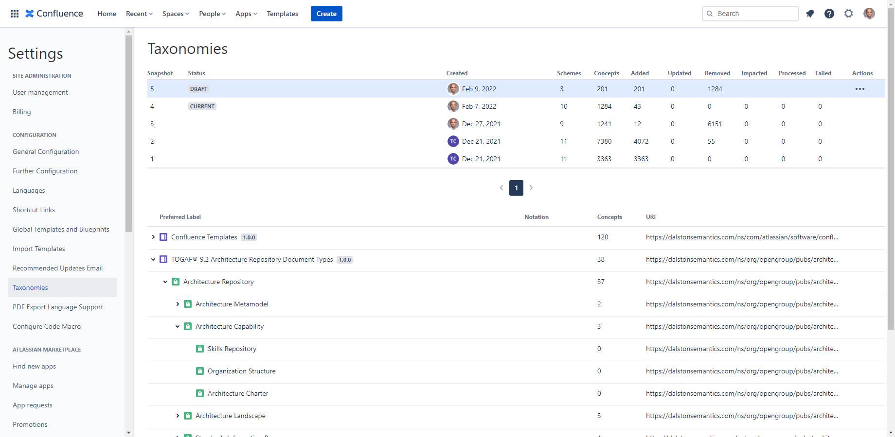

# TOGAF® Architecture Repository Taxonomy

This taxonomy of Enterprise Architecture Repository document types built with [Simple Knowledge Organization System](https://www.w3.org/2004/02/skos/) is based on [Chapter 37 of TOGAF® 9.2 - Architecture Repository](https://pubs.opengroup.org/architecture/togaf9-doc/arch/chap37.html).

Use it with [Taxonomies for Confluence](https://dalstonsemantics.com/services/taxonomies-for-confluence/) add-on to classify [Confluence](https://www.atlassian.com/software/confluence) pages and build enterprise architecture knowledge graph.

## Trademarks

TOGAF is a registered trademark of The Open Group.